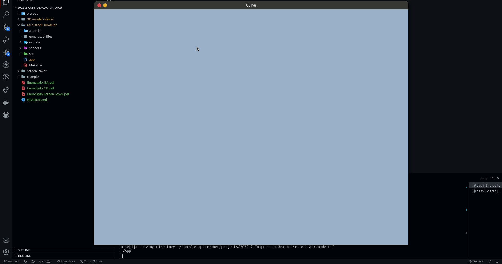
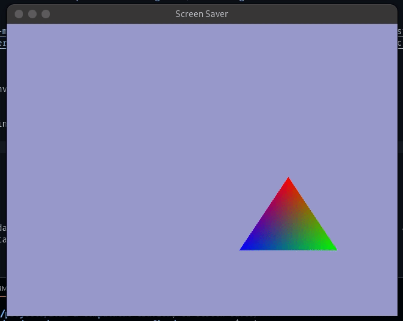

## 💻 Repositório

Repositório criado para o desenvolvimento dos projetos da cadeira de Computação Gráfica do curso de Ciência da Computação da Unisinos.

- [3D-model-viewer](https://github.com/FelipeBrenner/2022-2-Computacao-Grafica/tree/master/3D-model-viewer)

<p align="center">
  
  
  
</p>

- [race-track-modeler](https://github.com/FelipeBrenner/2022-2-Computacao-Grafica/tree/master/race-track-modeler)

<p align="center">
  
</p>

- [screen-saver](https://github.com/FelipeBrenner/2022-2-Computacao-Grafica/tree/master/screen-saver)

<p align="center">
  
</p>

## ⚙ Execução

Projetos desenvolvidos e executados no SO Linux, basicamente instalar GLFW e GLEW:

```bash
sudo apt-get install libglfw3 libglfw3-dev libglew-dev
```

E rodar:

```bash
make run
```

Qualquer dúvida para erros ocorridos nos projetos, ou determinada modificação no código e arquivos para funcionar de maneira diferente, podem entrar em contato comigo.
